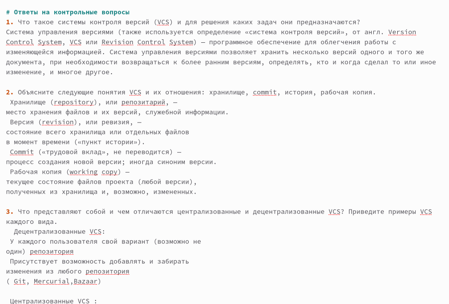
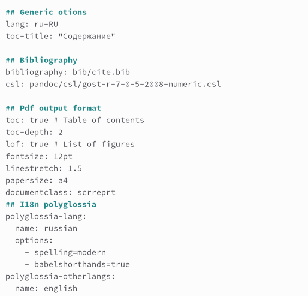
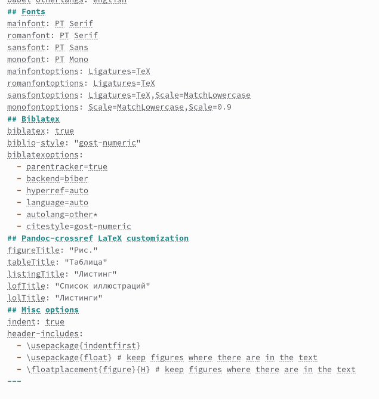
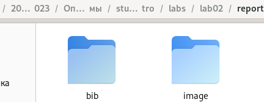
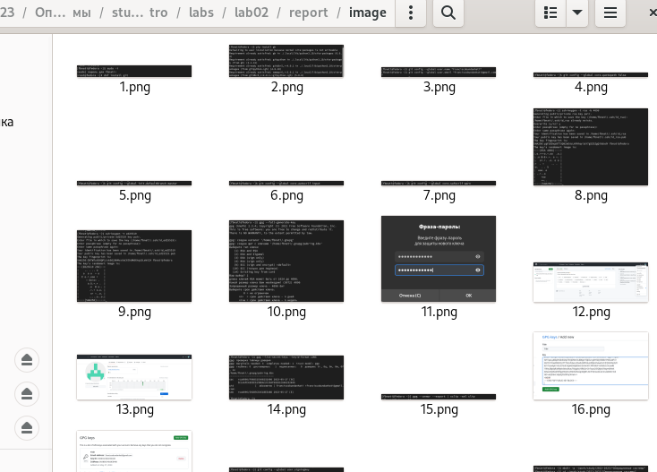

---
## Front matter
lang: ru-RU
title: Markdown
subtitle: Лабораторная работа №3
author:
  - Нати Ф. Б.
institute:
  - Российский университет дружбы народов, Москва, Россия

## i18n babel
babel-lang: russian
babel-otherlangs: english

## Formatting pdf
toc: false
toc-title: Содержание
slide_level: 2
aspectratio: 169
section-titles: true
theme: metropolis
header-includes:
 - \metroset{progressbar=frametitle,sectionpage=progressbar,numbering=fraction}
 - '\makeatletter'
 - '\beamer@ignorenonframefalse'
 - '\makeatother'
backgroundColor: orange
---

# Информация

## Докладчик

:::::::::::::: {.columns align=center}
::: {.column width="60%"}

  * Нати Франшиску Бунда
  * студент 1 курса, группа НММбд-02-22
  * Российский университет дружбы народов

:::
::: {.column width="40%"}

:::
::::::::::::::

# Вводная часть

## Объект и предмет исследования

- pandoc
- makdown

## Цель работы

- Научиться оформлять отчёты с помощью легковесного языка разметки Markdown.

## Задание
1. Сделать отчёт по предыдущей лабораторной работе в формате Markdown.
2. В качестве отчёта предоставить отчёты в 3 форматах: pdf, docx и md (в архиве,
поскольку он должен содержать скриншоты, Makefile и т.д.)

# Выполнение лабораторной работы №3

## Структурная составляющая отчета

:::::::::::::: {.columns align=center}

::: {.column width="50%"}

:::

::: {.column width="50%"}

:::

::: {.column width="50%"}

:::
::::::::::::::

## Структурная составляющая отчета

:::::::::::::: {.columns align=center}

::: {.column width="50%"}

:::

::: {.column width="50%"}

:::

::: {.column width="50%"}

:::

::::::::::::::

## Техническая составляющая отчета

:::::::::::::: {.columns align=center}

::: {.column width="50%"}

:::

::: {.column width="50%"}

:::

::: {.column width="50%"}

:::

::::::::::::::

## Техническая составляющая отчета

:::::::::::::: {.columns align=center}

::: {.column width="50%"}

:::

::: {.column width="50%"}

:::

::::::::::::::

## Техническая составляющая отчета

:::::::::::::: {.columns align=center}

::: {.column width="50%"}

:::

::: {.column width="50%"}

:::
::::::::::::::

## Техническая составляющая отчета

:::::::::::::: {.columns align=center}

::: {.column width="30%"}

:::

::: {.column width="30%"}

:::

::: {.column width="30%"}

:::

::::::::::::::

# Результаты

## Выводы из лабораторной работы №3

В ходе выполнения лабораторной работы были изучены способы оформления отчётов с помощью легковесного языка разметки Markdown.

